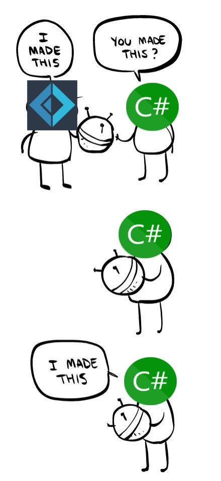

- title : Hopac - The Other Async
- description : Introduction toHopac
- author : Jimmy Byrd
- theme : night
- transition : default

***

## [Hopac](https://github.com/Hopac/Hopac)


##### The Other Async

[Jimmy Byrd](https://twitter.com/jimmy_byrd)


***

## What is Hopac?

> "Hopac is a library for F# with the aim of making it easier to write correct, modular and efficient parallel, asynchronous, concurrent and reactive programs." - [Hopac Docs](https://hopac.github.io/Hopac/Hopac.html)

***

## Before we talk more about Hopac


##### We need to talk about [F# Asyncs](https://docs.microsoft.com/en-us/dotnet/fsharp/tutorials/asynchronous-and-concurrent-programming/async) and [BCL Tasks](https://docs.microsoft.com/en-us/dotnet/standard/parallel-programming/task-based-asynchronous-programming)

---


### What are Asyncs and Tasks?

- They are a placeholder for a value that doesn't exist yet
- Similar to Scala Futures or JavaScript Promises


--- 

```fsharp
open System.Net
open Microsoft.FSharp.Control.WebExtensions


let fetchAsync(name, url:string) =
    async {
        try
            let uri = new System.Uri(url)
            let webClient = new WebClient()
            let! html = webClient.AsyncDownloadString(uri)
            printfn "Read %d characters for %s" html.Length name
        with
            | ex -> printfn "%s" (ex.Message);
    }

```

---

```csharp
using System.Net;

async Task FetchAsync(string name, string url)
{
    try 
    {
        var uri = new System.Uri(url);
        var webClient = new WebClient();
        var html = await webClient.DownloadStringAsync(uri);
        Console.Writeline("Read {0} characters for {1}", html.Length, name);
    }
    catch(Exception e) {
        Console.Writeline(e);
    }
}
```

---

### Async vs Task

|                | Async    | Task           |
|----------------|----------|----------------|
| Tail Recursive | Yes      | No             |
| Memory         | High     | Low            |
| CPU            | High     | Low            |
| Built in CE    | Yes      | TaskBuilder.fs |
| Cancellation   | Built in | Must pass in   |
| Evaluation     | Lazy/Cold | Eager/Hot     |

---

### Why are there two distinct programming models for async programming in F#?

Well...

---




***

Questions so far?

***

## So where does hopac fit in?

* Hopac adds more succinct models for concurrent concepts

---


---

## Hopac's Inheritance Model

```
                           Job<_>
                            |
                           Alt<_>
                            |
      +-------+--------+----+-----+--------+--------+
      |       |        |          |        |        |
     Ch<_>  Latch   Mailbox<_>  MVar<_>  Proc   Promise<_>
                                                    |
                                                  IVar<_>
```
---

Focusing only on

- Job
- Alt
- Ch
- Promise
- IVar
- Mailbox
- Streams (extra)

---

| Name | Description    | Closest Equivalent           |
|----------------|----------|----------------|
| Job | A lightweight thread of execution | Un-cancellable Task/Async
| Alt | A selective synchronous operation | Cancellable Task/Async
| Ch  | A synchronous channel | 1 Length Bounded Mailbox/Queue
| Promise | A run-once/memoized Alternative | A memoized Async or completed Task

---

| Name | Description    | Closest Equivalent           |
|----------------|----------|----------------|
| IVar | A write once only variable | TaskCompletionSource
| Mailbox | An asynchronous, unbounded buffered mailbox | MailboxProcess/Actor/Agent
| Stream | A lazy lists of promises | IAsyncEnumerable/Reactive Extensions


***

## Examples locally

* Evenluation - Shows Jobs
* Recurusion - Shows Jobs
* Cancellation - Shows Alts and IVars
* Memoization - Shows Promises

---

## Examples in the wild

### Threadsafe websockets

* [Task](https://github.com/TheAngryByrd/FSharp.Control.WebSockets/tree/master/src/FSharp.Control.Websockets.TPL)
* [Async](https://github.com/TheAngryByrd/FSharp.Control.WebSockets/tree/master/src/FSharp.Control.Websockets)
* [Hopac](https://github.com/TheAngryByrd/Hopac.Websockets)

---


## Examples in the wild

Result types

* [Task](https://github.com/demystifyfp/FsToolkit.ErrorHandling/tree/master/src/FsToolkit.ErrorHandling.TaskResult)
* [Async](https://github.com/demystifyfp/FsToolkit.ErrorHandling/tree/master/src/FsToolkit.ErrorHandling)
* [Hopac](https://github.com/demystifyfp/FsToolkit.ErrorHandling/tree/master/src/FsToolkit.ErrorHandling.JobResult)

---


## Examples in the wild

Streams

* [Reactive Extensions](https://github.com/TheAngryByrd/FSharp.Control.Redis.Streams/tree/master/src/FSharp.Control.Redis.Streams.Reactive)
* [Akka.net Streams](https://github.com/TheAngryByrd/FSharp.Control.Redis.Streams/tree/master/src/FSharp.Control.Redis.Streams.Akka)
* [Hopac Streams](https://github.com/TheAngryByrd/FSharp.Control.Redis.Streams/tree/master/src/FSharp.Control.Redis.Streams.Hopac)


***


### For a real in depth dive


